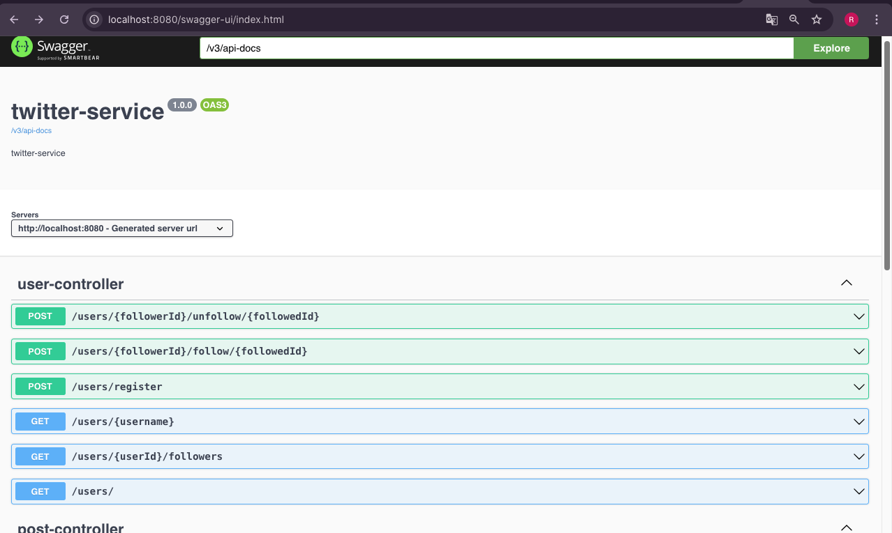
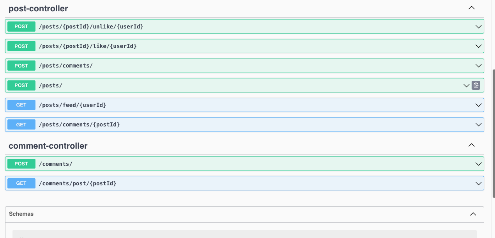

Quick workable solution



Test task for 1+1(kyivstart tb)

```
Technology stack

Java 21
Spring Boot framework 3.2.2
MongoDB database 7.0
Maven builder
Junit5/Testcontainers

All processes should be covered with tests.
Application and all related services should be deployed in Docker containers with docker compose.

Task

We need to write an API for an analog of Twitter. 

The user can :
- register, log in, log out, (here in memory spring security could be used)
- see his followers (list of users on which user is subscribed)
- follow another user (create new subscription)
- see his feed (a list of posts by people he follows(should be sorted by publication date)
- see another user's feed (without his subscriptions, only specific user post sorted by publication date, feed pagination would be a plus)
- leave a post on his feed
- comment on a post from any feed (just simple list of comments without threading)
- leave or remove a like on a post (his own or someone else's)
```